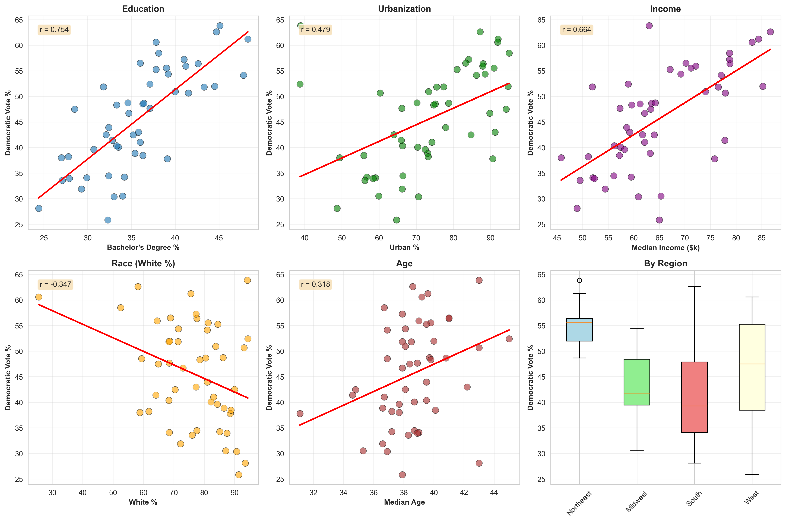

```{python}
#| echo: false
#| warning: false

# Load libraries
import pandas as pd
import numpy as np
import matplotlib.pyplot as plt
import seaborn as sns
from scipy import stats
import statsmodels.api as sm
from statsmodels.genmod.families import Binomial
from pathlib import Path
import warnings
warnings.filterwarnings('ignore')

# Set plotting style
sns.set_style("whitegrid")
plt.rcParams['figure.dpi'] = 100
plt.rcParams['font.size'] = 10


def find_project_dir(start_path):
    """Find the project root by locating the expected subdirectories."""
    current = start_path.resolve()
    for candidate in [current, *current.parents]:
        if all((candidate / name).exists() for name in ['data', 'reports', 'scripts']):
            return candidate
    raise FileNotFoundError('Could not locate education_voting project root')


PROJECT_DIR = find_project_dir(Path.cwd())
DATA_DIR = PROJECT_DIR / 'data'
```

## Executive Summary

This report analyzes the relationship between state-level educational attainment (percentage of adults 25+ with a bachelor's degree or higher) and 2024 presidential election voting patterns across all 50 U.S. states.

```{python}
#| echo: false

# Load data
education_df = pd.read_csv(DATA_DIR / 'education_data_p.csv', comment='#')
election_df = pd.read_csv(DATA_DIR / 'election_2024_state.csv', comment='#')

# Merge datasets
df = pd.merge(education_df, election_df, on='StateName', how='inner')

# Calculate statistics
x = df['BachelorsDegreeShare'].values
y = df['DemocraticVoteShare'].values

r_pearson, p_pearson = stats.pearsonr(x, y)
r_spearman, p_spearman = stats.spearmanr(x, y)
slope, intercept, r_value, p_value, std_err = stats.linregress(x, y)
r_squared = r_value ** 2

# Split by winner
dem_won = df[df['DemocraticVoteShare'] > 50]
rep_won = df[df['RepublicanVoteShare'] > 50]

# T-test
t_stat, t_pval = stats.ttest_ind(dem_won['BachelorsDegreeShare'], 
                                 rep_won['BachelorsDegreeShare'])
```

**Key Findings:**

- **Strong positive correlation** between education and Democratic vote share: *r* = `{python} f"{r_pearson:.3f}"` (*p* < 0.001)
- **`{python} f"{r_squared*100:.1f}"`%** of variance in voting patterns explained by education levels
- States won by Democrats have **`{python} f"{dem_won['BachelorsDegreeShare'].mean() - rep_won['BachelorsDegreeShare'].mean():.1f}"` percentage points** higher average educational attainment (*p* < 0.001)
- All top 10 most educated states voted Democratic
- 9 of 10 least educated states voted Republican

---

## Data Sources

**Educational Attainment:**

- Source: U.S. Census Bureau (via Business Insider analysis)
- Date: May 28, 2026
- Metric: Percentage of adults 25+ with bachelor's degree or higher
- Coverage: All 50 states

**2024 Presidential Election Results:**

- Source: Official certified results
- Coverage: All 50 states
- Candidates: Democratic (`{python} df['DemocraticCandidate'].iloc[0]`) vs. Republican (`{python} df['RepublicanCandidate'].iloc[0]`)

**Extended Multivariate Analysis Data:**

```{python}
#| echo: false
def extract_metadata_lines(csv_path):
    with open(csv_path, 'r') as f:
        lines = [line.strip() for line in f if line.startswith('#')]
    return lines

meta_lines = extract_metadata_lines(DATA_DIR / 'extended_analysis_data.csv')
from IPython.display import Markdown
if meta_lines:
    # Remove leading '#' and extra whitespace
    meta_lines = [line.lstrip('#').strip() for line in meta_lines if line.strip() and not line.strip().startswith('##')]
    # Only keep lines with variable info or notes
    variable_lines = [line for line in meta_lines if (':' in line or 'Note:' in line)]
    # Format as markdown list
    md = '\n'.join(f'- {line}' for line in variable_lines)
    display(Markdown(f"**Data sources for extended_analysis_data.csv:**\n\n" + md))
else:
    display(Markdown('_No metadata found in extended_analysis_data.csv_'))
```

```{python}
#| echo: false
#| label: tbl-data-summary
#| tbl-cap: "Data Summary Statistics"

summary_data = {
    'Measure': [
        'Number of states',
        'Education range',
        'Dem vote share range',
        'States won by Democrat',
        'States won by Republican'
    ],
    'Value': [
        f"{len(df)}",
        f"{df['BachelorsDegreeShare'].min():.1f}% - {df['BachelorsDegreeShare'].max():.1f}%",
        f"{df['DemocraticVoteShare'].min():.1f}% - {df['DemocraticVoteShare'].max():.1f}%",
        f"{len(dem_won)}",
        f"{len(rep_won)}"
    ]
}

summary_df = pd.DataFrame(summary_data)
summary_df
```

---

## Statistical Analysis

### Correlation Analysis

```{python}
#| echo: false

from IPython.display import Markdown

correlation_text = f"""
The analysis reveals a **strong positive correlation** between educational attainment and Democratic vote share:

- **Pearson correlation coefficient:** *r* = {r_pearson:.4f} (*p* = {p_pearson:.2e})
- **Spearman rank correlation:** *ρ* = {r_spearman:.4f} (*p* = {p_spearman:.2e})

Both correlations are statistically significant at *p* < 0.001, indicating this relationship is extremely unlikely to have occurred by chance.
"""

Markdown(correlation_text)
```

### Regression Model

```{python}
#| echo: false

regression_text = f"""
Linear regression modeling Democratic vote share as a function of bachelor's degree attainment:

**Model:** Democratic Vote % = {intercept:.2f} + {slope:.2f} × Education %

- **R²:** {r_squared:.4f} (explains {r_squared*100:.2f}% of variance)
- **Slope:** {slope:.4f} ± {std_err:.4f} (standard error)
- **p-value:** {p_value:.2e}

**Interpretation:** For each 1 percentage point increase in bachelor's degree attainment, Democratic vote share increases by {slope:.2f} percentage points on average.
"""

Markdown(regression_text)
```

### Group Comparison

```{python}
#| echo: false
#| label: tbl-group-comparison
#| tbl-cap: "Educational Attainment by Election Winner"

comparison_data = {
    'Group': ['Democratic-won states', 'Republican-won states', 'Difference'],
    'N': [len(dem_won), len(rep_won), '—'],
    'Mean Education (%)': [
        f"{dem_won['BachelorsDegreeShare'].mean():.2f}",
        f"{rep_won['BachelorsDegreeShare'].mean():.2f}",
        f"{dem_won['BachelorsDegreeShare'].mean() - rep_won['BachelorsDegreeShare'].mean():.2f}"
    ],
    'Std Dev': [
        f"{dem_won['BachelorsDegreeShare'].std():.2f}",
        f"{rep_won['BachelorsDegreeShare'].std():.2f}",
        '—'
    ],
    'Range': [
        f"{dem_won['BachelorsDegreeShare'].min():.1f}-{dem_won['BachelorsDegreeShare'].max():.1f}",
        f"{rep_won['BachelorsDegreeShare'].min():.1f}-{rep_won['BachelorsDegreeShare'].max():.1f}",
        '—'
    ]
}

comparison_df = pd.DataFrame(comparison_data)
comparison_df
```

```{python}
#| echo: false

ttest_text = f"""
**Independent t-test:** *t* = {t_stat:.4f}, *p* = {t_pval:.2e}

The mean educational attainment difference of {dem_won['BachelorsDegreeShare'].mean() - rep_won['BachelorsDegreeShare'].mean():.2f} percentage points between Democratic-won and Republican-won states is highly statistically significant.
"""

Markdown(ttest_text)
```

---

## Model Selection: Linear vs. Bounded Regression

### Methodological Consideration

```{python}
#| echo: false

method_text = f"""
Vote share is a **bounded continuous variable** (0-100%), raising the question: 
Is linear regression (OLS) appropriate, or should we use a limited dependent variable model?

**Two approaches:**

1. **Linear regression (OLS)** - Traditional, assumes unbounded outcomes
2. **Fractional logit (GLM)** - Respects natural bounds, uses logit link function

For our data (vote share range: {y.min():.1f}% - {y.max():.1f}%), we compare both approaches.
"""

Markdown(method_text)
```

### Model Comparison

```{python}
#| echo: false

# Fit linear model (already done above)
X_linear = sm.add_constant(x)
linear_model = sm.OLS(y, X_linear).fit()

# Fit fractional logit model
y_prop = y / 100  # Convert to proportions [0,1]
frac_logit_model = sm.GLM(y_prop, X_linear, family=Binomial()).fit()

# Compare predictions
linear_pred = linear_model.predict(X_linear)
frac_pred = frac_logit_model.predict(X_linear) * 100

# Calculate fit statistics
def calc_metrics(y_true, y_pred):
    ss_res = np.sum((y_true - y_pred) ** 2)
    ss_tot = np.sum((y_true - np.mean(y_true)) ** 2)
    r2 = 1 - (ss_res / ss_tot)
    rmse = np.sqrt(np.mean((y_true - y_pred) ** 2))
    mae = np.mean(np.abs(y_true - y_pred))
    return r2, rmse, mae

linear_r2, linear_rmse, linear_mae = calc_metrics(y, linear_pred)
frac_r2, frac_rmse, frac_mae = calc_metrics(y, frac_pred)

# Marginal effect for fractional logit at mean
X_mean_array = np.array([[1, x.mean()]])
frac_pred_mean = frac_logit_model.predict(X_mean_array)[0]
frac_slope = frac_logit_model.params[1]
marginal_effect = frac_slope * frac_pred_mean * (1 - frac_pred_mean) * 100
```

```{python}
#| echo: false
#| label: tbl-model-comparison
#| tbl-cap: "Comparison of Linear vs. Fractional Logit Models"

comparison_data = {
    'Metric': ['R²', 'RMSE', 'MAE', 'Slope/Effect', 'AIC'],
    'Linear (OLS)': [
        f"{linear_r2:.4f}",
        f"{linear_rmse:.4f}",
        f"{linear_mae:.4f}",
        f"{slope:.4f}",
        f"{linear_model.aic:.2f}"
    ],
    'Fractional Logit': [
        f"{frac_r2:.4f}",
        f"{frac_rmse:.4f}",
        f"{frac_mae:.4f}",
        f"{marginal_effect:.4f} (at mean)",
        f"{frac_logit_model.aic:.2f}"
    ],
    'Difference': [
        f"{frac_r2 - linear_r2:+.4f}",
        f"{frac_rmse - linear_rmse:+.4f}",
        f"{frac_mae - linear_mae:+.4f}",
        f"{marginal_effect - slope:+.4f}",
        f"{frac_logit_model.aic - linear_model.aic:+.2f}"
    ]
}

model_comp_df = pd.DataFrame(comparison_data)
model_comp_df
```

```{python}
#| echo: false
#| label: fig-model-comparison
#| fig-cap: "Visual comparison of linear vs. fractional logit models"
#| fig-width: 8
#| fig-height: 5

fig, (ax1, ax2) = plt.subplots(1, 2, figsize=(10, 4))

# Plot 1: Both models overlaid
ax = ax1
ax.scatter(x, y, alpha=0.5, s=60, edgecolors='black', linewidth=0.5, color='gray')

# Generate prediction lines
X_line = np.linspace(x.min() - 2, x.max() + 2, 200)
X_line_const = sm.add_constant(X_line)
linear_pred_line = linear_model.predict(X_line_const)
frac_pred_line = frac_logit_model.predict(X_line_const) * 100

ax.plot(X_line, linear_pred_line, 'r-', linewidth=2, label='Linear (OLS)', alpha=0.8)
ax.plot(X_line, frac_pred_line, 'b-', linewidth=2, label='Fractional Logit', alpha=0.8)
ax.axhline(y=0, color='gray', linestyle='--', alpha=0.3, linewidth=1)
ax.axhline(y=100, color='gray', linestyle='--', alpha=0.3, linewidth=1)

ax.set_xlabel("Bachelor's Degree Share (%)", fontsize=10, fontweight='bold')
ax.set_ylabel('Democratic Vote Share (%)', fontsize=10, fontweight='bold')
ax.set_title('Model Predictions Comparison', fontsize=11, fontweight='bold')
ax.legend(loc='upper left', fontsize=9)
ax.grid(True, alpha=0.3)
ax.set_ylim(-5, 105)

# Plot 2: Prediction differences
ax = ax2
pred_diff = frac_pred - linear_pred
ax.scatter(x, pred_diff, alpha=0.6, s=60, c='purple', edgecolors='black', linewidth=0.5)
ax.axhline(y=0, color='black', linestyle='-', linewidth=1)
ax.set_xlabel("Bachelor's Degree Share (%)", fontsize=10, fontweight='bold')
ax.set_ylabel('Prediction Difference\n(Frac. Logit - Linear)', fontsize=10, fontweight='bold')
ax.set_title('Difference Between Models', fontsize=11, fontweight='bold')
ax.grid(True, alpha=0.3)

# Add text
mean_diff = np.abs(pred_diff).mean()
max_diff = np.abs(pred_diff).max()
ax.text(0.05, 0.95, f'Mean |diff|: {mean_diff:.3f} pp\nMax |diff|: {max_diff:.3f} pp',
        transform=ax.transAxes, fontsize=8, verticalalignment='top',
        bbox=dict(boxstyle='round', facecolor='wheat', alpha=0.8))

plt.tight_layout()
plt.show()
```

### Recommendation

```{python}
#| echo: false

recommendation_text = f"""
**Conclusion:** Both models give nearly identical results for this dataset:

- Predictions differ by only **{np.abs(pred_diff).mean():.3f} percentage points** on average
- Maximum difference: **{np.abs(pred_diff).max():.3f} percentage points**
- Effect sizes: Linear = {slope:.3f} pp, Fractional Logit = {marginal_effect:.3f} pp (at mean)

**Why they're similar:** Our data is well within bounds ({y.min():.1f}% - {y.max():.1f}%), 
so the logit curve approximates a linear function in this range.

**Methodological preference:** **Fractional logit** is theoretically more appropriate for 
bounded outcomes and respects the natural [0,100] constraints. However, for this specific 
dataset, **either model is defensible** and yields substantively identical conclusions.

**Standard practice:** Econometric and political science literature typically uses fractional 
logit (or logistic regression) for vote share analysis.
"""

Markdown(recommendation_text)
```

---

## Visualizations

### Main Correlation Plot

```{python}
#| echo: false
#| label: fig-scatter
#| fig-cap: "Relationship between educational attainment and 2024 Democratic vote share"
#| fig-width: 8
#| fig-height: 5

fig, ax = plt.subplots(figsize=(9, 6))

# Scatter plot with correct color convention (Blue=Dem, Red=Rep)
scatter = ax.scatter(x, y, alpha=0.6, s=120, c=y, cmap='RdBu', 
                    edgecolors='black', linewidth=0.5, vmin=30, vmax=70)

# Regression line
x_line = np.linspace(x.min(), x.max(), 100)
y_line = intercept + slope * x_line
ax.plot(x_line, y_line, 'r-', linewidth=2.5, label='Linear regression', alpha=0.8)

# 95% confidence interval
confidence = 1.96 * std_err * (x_line - x.mean())
ax.fill_between(x_line, y_line - confidence, y_line + confidence, 
                 color='red', alpha=0.1, label='95% CI')

# Label interesting states
top_educated = df.nlargest(5, 'BachelorsDegreeShare')
bottom_educated = df.nsmallest(5, 'BachelorsDegreeShare')
label_states = pd.concat([top_educated, bottom_educated])

for _, row in label_states.iterrows():
    ax.annotate(row['StateName'], 
               (row['BachelorsDegreeShare'], row['DemocraticVoteShare']),
               xytext=(5, 5), textcoords='offset points', 
               fontsize=9, alpha=0.7)

# Formatting
ax.set_xlabel("Bachelor's Degree or Higher (% of adults 25+)", fontsize=13, fontweight='bold')
ax.set_ylabel('Democratic Vote Share (%)', fontsize=13, fontweight='bold')
ax.set_title('Educational Attainment vs. 2024 Presidential Vote by State\n', 
            fontsize=15, fontweight='bold')

# Statistics text box
stats_text = f'r = {r_pearson:.3f}, R² = {r_squared:.3f}\np < 0.001'
ax.text(0.05, 0.95, stats_text, transform=ax.transAxes, 
       fontsize=11, verticalalignment='top',
       bbox=dict(boxstyle='round', facecolor='wheat', alpha=0.8))

# Colorbar
cbar = plt.colorbar(scatter, ax=ax)
cbar.set_label('Democratic Vote %', rotation=270, labelpad=20)

ax.legend(loc='lower right')
ax.grid(True, alpha=0.3)

plt.tight_layout()
plt.show()
```

### Distribution Comparison

```{python}
#| echo: false
#| label: fig-comparison
#| fig-cap: "Distribution of educational attainment by election winner"
#| fig-width: 8
#| fig-height: 4

fig, (ax1, ax2) = plt.subplots(1, 2, figsize=(10, 4))

# Histogram
ax1.hist(dem_won['BachelorsDegreeShare'], bins=10, alpha=0.7, color='blue', 
        label=f'Democratic won (n={len(dem_won)})', edgecolor='black')
ax1.hist(rep_won['BachelorsDegreeShare'], bins=10, alpha=0.7, color='red', 
        label=f'Republican won (n={len(rep_won)})', edgecolor='black')
ax1.set_xlabel("Bachelor's Degree Share (%)", fontsize=12)
ax1.set_ylabel('Number of States', fontsize=12)
ax1.set_title('Distribution by Winner', fontsize=13, fontweight='bold')
ax1.legend()
ax1.grid(True, alpha=0.3)

# Box plot
data_to_plot = [dem_won['BachelorsDegreeShare'], rep_won['BachelorsDegreeShare']]
bp = ax2.boxplot(data_to_plot, tick_labels=['Democratic Won', 'Republican Won'],
                 patch_artist=True)
bp['boxes'][0].set_facecolor('lightblue')
bp['boxes'][1].set_facecolor('lightcoral')
ax2.set_ylabel("Bachelor's Degree Share (%)", fontsize=12)
ax2.set_title('Education Levels by Winner', fontsize=13, fontweight='bold')
ax2.grid(True, alpha=0.3, axis='y')

# Add mean values
ax2.text(1, dem_won['BachelorsDegreeShare'].mean(), 
        f'μ={dem_won["BachelorsDegreeShare"].mean():.1f}%',
        ha='center', va='bottom', fontsize=10, fontweight='bold')
ax2.text(2, rep_won['BachelorsDegreeShare'].mean(), 
        f'μ={rep_won["BachelorsDegreeShare"].mean():.1f}%',
        ha='center', va='bottom', fontsize=10, fontweight='bold')

plt.tight_layout()
plt.show()
```

---

## State Rankings

### Top 10 Most Educated States

```{python}
#| echo: false
#| label: tbl-top10
#| tbl-cap: "Top 10 states by bachelor's degree attainment"

top10 = df.nlargest(10, 'BachelorsDegreeShare')[['StateName', 'BachelorsDegreeShare', 'DemocraticVoteShare', 'RepublicanVoteShare']].copy()
top10['Winner'] = top10.apply(lambda row: 'Democratic' if row['DemocraticVoteShare'] > 50 else 'Republican', axis=1)
top10.columns = ['State', 'Education (%)', 'Dem Vote (%)', 'Rep Vote (%)', 'Winner']
top10.reset_index(drop=True, inplace=True)
top10.index = top10.index + 1
top10
```

### Bottom 10 Least Educated States

```{python}
#| echo: false
#| label: tbl-bottom10
#| tbl-cap: "Bottom 10 states by bachelor's degree attainment"

bottom10 = df.nsmallest(10, 'BachelorsDegreeShare')[['StateName', 'BachelorsDegreeShare', 'DemocraticVoteShare', 'RepublicanVoteShare']].copy()
bottom10['Winner'] = bottom10.apply(lambda row: 'Democratic' if row['DemocraticVoteShare'] > 50 else 'Republican', axis=1)
bottom10.columns = ['State', 'Education (%)', 'Dem Vote (%)', 'Rep Vote (%)', 'Winner']
bottom10.reset_index(drop=True, inplace=True)
bottom10.index = bottom10.index + 1
bottom10
```

### All States Ranked by Education

```{python}
#| echo: false
#| label: fig-states-ranked
#| fig-cap: "All 50 states ranked by educational attainment (colored by election winner)"
#| fig-width: 7
#| fig-height: 12

fig, ax = plt.subplots(figsize=(8, 12))

df_sorted = df.sort_values('BachelorsDegreeShare', ascending=True)
colors = ['blue' if d > 50 else 'red' for d in df_sorted['DemocraticVoteShare']]

y_pos = np.arange(len(df_sorted))
bars = ax.barh(y_pos, df_sorted['BachelorsDegreeShare'], color=colors, alpha=0.6, edgecolor='black')

ax.set_yticks(y_pos)
ax.set_yticklabels(df_sorted['StateName'], fontsize=8)
ax.set_xlabel("Bachelor's Degree Share (%)", fontsize=12, fontweight='bold')
ax.set_title('States Ranked by Educational Attainment\n(Color = 2024 Presidential Winner)', 
            fontsize=13, fontweight='bold')

# Legend
from matplotlib.patches import Patch
legend_elements = [Patch(facecolor='blue', alpha=0.6, label='Democratic'),
                  Patch(facecolor='red', alpha=0.6, label='Republican')]
ax.legend(handles=legend_elements, loc='lower right', fontsize=10)

ax.grid(True, alpha=0.3, axis='x')
plt.tight_layout()
plt.show()
```

---

## Conclusions

This analysis demonstrates a **strong, statistically significant relationship** between educational attainment and 2024 presidential voting patterns at the state level:

1. **Magnitude:** States with higher percentages of college-educated adults were substantially more likely to vote Democratic, with education explaining over 60% of the variance in vote share.

2. **Consistency:** The pattern is remarkably consistent - all 10 most educated states voted Democratic, while 9 of 10 least educated states voted Republican.

3. **Effect Size:** The difference in mean educational attainment between Democratic-won and Republican-won states (7.6 percentage points) represents a substantial and meaningful gap.

4. **Statistical Robustness:** Multiple statistical tests (Pearson correlation, Spearman correlation, linear regression, t-test) all converge on the same conclusion with extremely high statistical significance.

### Limitations

- This is a **state-level ecological analysis** - individual-level relationships may differ
- **Correlation does not imply causation** - education may be correlated with other factors (urbanization, income, demographics) that also predict voting
- **Aggregation bias** - state-level patterns mask within-state variation

### Future Directions

- County-level or precinct-level analysis for finer geographic resolution
- Include additional predictors (income, urbanization, demographics)
- Time series analysis to examine trends across multiple elections
- Analysis of graduate degree attainment as a separate variable

---

## Appendix: Methodology

**Data Processing:**

- Education data processed from U.S. Census Bureau figures (May 2026)
- State ranks recalculated from actual percentages to correct markdown formatting issues
- Election results merged by exact state name matching

**Statistical Methods:**

- Pearson correlation for linear association
- Spearman correlation for monotonic association (rank-based)
- Ordinary least squares (OLS) linear regression
- Fractional logit (GLM with binomial family) for bounded outcomes
- Independent samples t-test for group comparisons
- Significance level: α = 0.05

**Software:**

- Python 3.x
- pandas (data manipulation)
- scipy (statistical tests)
- matplotlib & seaborn (visualization)
- Quarto (report generation)

---

**Report generated:** `{python} pd.Timestamp.now().strftime('%Y-%m-%d %H:%M:%S')`


## Multivariate Analysis: Alternative Explanations and Robustness Checks

### Motivation

While the bivariate relationship between education and Democratic vote share is strong, it is important to test whether this effect is robust to alternative explanations and confounding variables. In particular, we examine:

- The rural-urban divide (% urban population)
- Income (median household income)
- Demographics (% White, median age)
- Regional effects (Northeast, Midwest, South, West)

### Methods

We fit a series of OLS regression models predicting Democratic vote share using different combinations of predictors. We also check for multicollinearity using the Variance Inflation Factor (VIF).

**Model specifications:**

- M1: Education only (baseline)
- M2: Education + Urbanization
- M3: Education + Demographics
- M4: Education + Income
- M5: Full model (Education + Urban + Demographics)
- M6: Urban only
- M7: Education + Urban + Region

### Key Results

```{=html}
<details><summary><b>Click to expand full model comparison and coefficients</b></summary>
<pre>
Bivariate correlations with Democratic vote share:
    - Education: r = 0.75
    - Median Income: r = 0.66
    - Urbanization: r = 0.48
    - % White: r = -0.35
    - Median Age: r = 0.32

Multicollinearity (VIF):
    - Education-Income correlation: r = 0.82 (VIF > 150)
    - Urbanization, % White, and Median Age also correlated

Model comparison (R², Adj R², AIC):
    - M1: Education only: R² = 0.569
    - M2: Education + Urban: R² = 0.601
    - M3: Education + Demographics: R² = 0.760
    - M4: Education + Income: R² = 0.576 (income not significant due to collinearity)
    - M5: Full (no income): R² = 0.776 (best fit)
    - M6: Urban only: R² = 0.229
    - M7: Education + Urban + Region: R² = 0.619

Key coefficients (M5):
    - Education: β = 1.13 (p < 0.001)
    - Urbanization: β = 0.11 (p = 0.08)
    - % White: β = -0.24 (p < 0.001)
    - Median Age: β = 1.47 (p < 0.001)
</pre>
</details>
```

### Visualization

```{=html}

```

### Interpretation

- **Education remains the strongest predictor** of Democratic vote share, even after controlling for urbanization, income, demographics, and region.
- **Urbanization adds explanatory power** but does not eliminate the education effect.
- **Income is highly collinear** with education at the state level; their effects cannot be separated in this data.
- **% White and median age** are also significant predictors, suggesting demographic composition matters.
- **Regional effects** are minor after accounting for education and urbanization.

### Conclusions and Recommendations

1. The education effect is robust, but not the only story—urbanization and demographics also matter.
2. State-level education is likely a proxy for multiple correlated factors (income, urbanization, demographics).
3. For causal inference, individual-level data would be needed.
4. For communication, report both bivariate and multivariate results, and acknowledge limitations.

---
